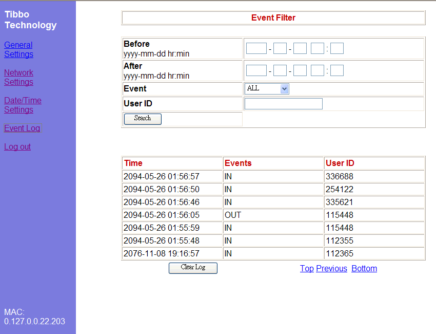

# Terminal Application Demo

This demo utilizes the EM1000-TEV and works as a data collection terminal, or more specifically, a time recorder. The IDs used for access are punched in using the keypad, though this can be easily changed to using a card reader.

The user can setup the date/time, network settings, terminal info, and more through a built-in **menu system** or using a **web interface**. The system also keeps an **event log** that can be checked through the web interface. The event log is saved in the internal flash disk for future access.

The system comes with default settings which can be loaded using the "Initialize" option. The terminal also supports basic setting setup with [DS Manager](http://docs.tibbo.com/soism/ds_manager.htm) and [Out-of-band](http://docs.tibbo.com/soism/bcast_out_of_band.htm) / [serial programming](http://docs.tibbo.com/soism/ser_prog.htm).

This demo works with two LCD types:

- Winstar WG12864F Black/White LCD panel with SAMSUNG S6B0108 controller ([LB0](http://docs.tibbo.com/phm/tev_lb0.htm))
- Ampire AM176220 TFT panel with HIMAX HX8309 controller ([LB2](http://docs.tibbo.com/phm/tev_lb2.htm)).

The demo also shows how functional libraries are implemented in a project and the advantage it poses for easy-to-reuse code. It is recommended that you initialize the system (reset to factory default values) the first time you power it up. This can be done through the terminal menu, web interface, DS Manager or through a [Firmware Command](http://docs.tibbo.com/soism/command_i.htm) issued through UDP or serial port.

## Terminal Interface

**Note**: The E and C keys serve the same purpose throughout the program: **E**nter and **C**ancel/**C**lear.

### #Main Screen:

The main screen is the default screen when powered up. This is where you enter in the ID number and select if you are punching in or out. You can also access the main menu from this screen.

**Keys:**

- **F1:** Punch in
- **F2:** Punch out
- **F3:** Enter
- **F4:** Main Menu
- **E:** Enter
- **C:** Clear (ID Entered)
- **0-9:** Numeric keys (for entering user ID)

### Main Menu:

- **Setup:** Go into the system setup menu
- **Reboot:** Reboot the system
- **Initialize:** Return to default settings
- **Clear Log:** Clear the access log

**Keys:**

- **F1:** Cancel / Exit
- **F2:** Navigate Up
- **F3:** Navigate Down
- **F4:** Enter
- **E:** Enter
- **C:** Cancel / Exit

### Setup Menu:

- **Network:** Setup DHCP, IP Address, Gateway IP and Netmask (subnet mask).
- **Date/Time:** Setup of Timer Server IP, Auto Sync, Date, Time and Time Zone.
- **Owner Name:** To enter a name with letters (and not just numbers), use the Web Interface.
- **Device Name:** To enter a name with letters (and not just numbers), use the Web Interface.

**Keys:**

- **F1:** Cancel / Exit
- **F2:** Navigate Up
- **F3:** Navigate Down
- **F4:** Enter
- **E:** Enter
- **C:** Cancel / Exit
- **0-9:** numeric keys

Main Screen  

Main Menu 

Setup Menu  

## Web Interface

The web pages offer the same functionality as the terminal interface, you can reach the pages by entering the IP address of the unit into your browser.

Using the web interface, you can access all the available settings just like when you are using the Terminal Interface and also be able to browse through the event log.

  

Login Page: The default password is 'admin' 

  

General Settings: Owner Name, Device Name and Password 

  

Network Settings: DHCP, IP Address, Gateway IP and Netmask 

Date/Time Settings: Date, Time, Time Server IP, Auto Sync and Time Zone 

Event Log: Access to event history and ability to perform search